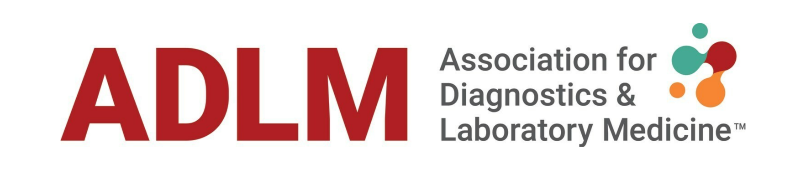
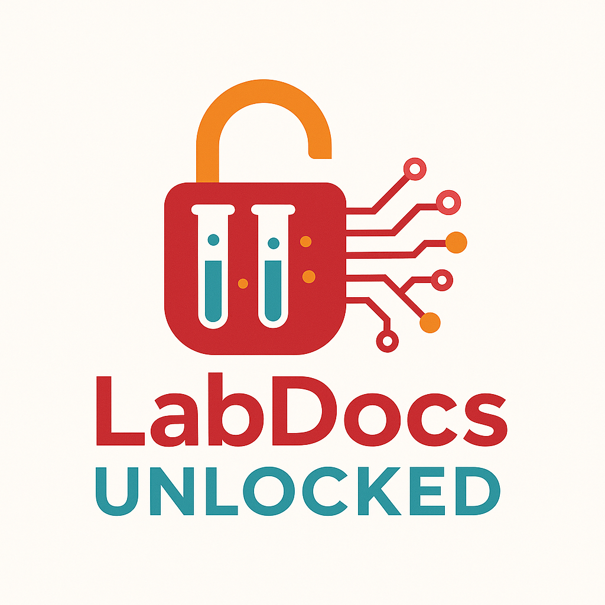

# LabDocs Unlocked

The 2025 ADLM Data Science Challenge



## Introduction



Laboratories generate vast amounts of documentation, ranging from protocols and package inserts to regulatory materials like 510K clearance documents and checklists. These critical resources require significant time and effort to navigate, presenting a challenge for efficient decision-making and compliance management.

The 2025 ADLM Data Science Challenge seeks to address this gap by leveraging the power of AI to create a tool capable of quickly and accurately extracting and presenting user-requested information from these complex document stores. The proposed solution would ensure that laboratory professionals can focus on impactful work rather than time-intensive document searches.

## The Challenge

### <span style="color:gray"><i>Develop a Tool for Extracting Information from a Laboratory Document Store</i></span>

We want you to develop an AI tool to make looking up information in laboratory documentation faster and more efficient.
We will provide a representative set of documents. Your tool should ingest these documents and then extract and present user-requested information from those documents.

## Preliminary Competition and Scoring

Teams will participate in a preliminary competition where they will be scored based on the following:

| Criterion       | Points | Description                                                                                                                                                                                                                                                                                                 |
| --------------- | ------ | ----------------------------------------------------------------------------------------------------------------------------------------------------------------------------------------------------------------------------------------------------------------------------------------------------------- |
| Accuracy        | 10     | Responses to a test set of user‑requests will be graded using a standardized scoring rubric.                                                                                                                                                                                                                |
| User experience | 10     | The tool and its output should be intuitive and easy to navigate.                                                                                                                                                                                                                                           |
| Explainability  | 10     | The tool should provide references or links to relevant sections in the document store.                                                                                                                                                                                                                     |
| Best practices  | 10     | Coding: <ul><li>Comments</li><li>Modularity</li><li>Reusability (e.g. can ingest new document store)</li> <li>Version control (logical commit histories)</li> </ul> Deployment <ul><li>Usage notes provided</li><li>Dependencies defined</li><li>Virtualization, containerization, or web hosting</li></ul> |

> [!note]
> Source code and commit histories are required to receive best practices points

## Final (Live) Competition

The top two teams from the preliminary competition will be invited to present how they built their solution in a live Webinar/competition event. The teams will then compete based on the speed and accuracy of their responses to a new set of questions presented "game show style." The team with the highest score will be declared the winner.

## Significance

Efficient access to laboratory documentation is essential for maintaining compliance, ensuring quality, and accelerating decision-making. This challenge addresses the inefficiencies caused by the complexity and volume of such documents by leveraging AI to streamline information retrieval. The resulting tool has the potential to transform workflows, reduce errors, and set a new standard for document management in laboratory practice.

## Timeline

| Date                        | Event                                                |
| --------------------------- | ---------------------------------------------------- |
| July 25th, 2025             | Competition Begins                                   |
| November 15th, 2025         | Preliminary Competition Ends                         |
| December 15th, 2025         | Announcement of Finalists                            |
| January, 2026 (Anticipated) | Finalists Presentations Webinar and Live Competition |

## How to Participate

> [!tip]
> If GitHub or any of the instructions below are unfamiliar to you, please reach out to us using the contact information at the bottom of this page. We will help you get set up to participate.

### Sign up for a GitHub.com account

1. Navigate to [https://github.com/](https://github.com/)
2. Click **Sign up**
3. Follow the prompts to create your personal account

### Fork the competition repository

1. Navigate to [https://github.com/myADLM/ADLM-2025-Data-Challenge/](https://github.com/myADLM/ADLM-2025-Data-Challenge/)
2. Click **Fork**
3. Select **Create a new fork**
4. Set your GitHub account as the owner (default)
5. Click **Create fork**

### Download the dataset

> [!caution]
> This dataset contains synthetic laboratory protocols that were generated by a large language model (LLM). These protocols are not validated methods and must not be used for any clinical, diagnostic, therapeutic, or patient‑care activities. They are provided solely for educational purposes.

> [!note]
> This dataset is about 3.5 gigabytes in size.

#### Command-line

Linux / MacOS

```bash
curl -L -C - -o LabDocs.zip \
    "https://zenodo.org/records/16328490/files/LabDocs.zip?download=1"

unzip LabDocs.zip
```

Windows

```bash
curl -L -C - -o LabDocs.zip \
    "https://zenodo.org/records/16328490/files/LabDocs.zip?download=1"

tar -xf LabDocs.zip
```

#### Manual Download via Browser

1.  Open this link in your browser:
    [https://zenodo.org/records/16328490](https://zenodo.org/records/16328490)
2.  Click **Download** (or **Save As…**) and save the file as `LabDocs.zip`.
3.  Use your operating system’s built-in extraction tool or one of the command-line method above.

### Build your solution

1. Clone the forked repository<br>

   ```bash
       git clone https://github.com/myGitHubUsername/ADLM-2025-Data-Challenge.git
   ```

> [!note]
> Replace myGitHubUsername with your GitHub handle

2. Make a folder in the cloned repository with your team name
3. Build your solution within your team folder and track your development with commits to the repository

### Submit your solution via a pull request

1. Push your commits to the forked repository
   ```bash
   git push
   ```
2. Navigate to https://github.com/myGitHubUsername/2025_ADLM_Data_Analytics_Challenge<br>
   > [!note]
   > Replace myGitHubUsername with your GitHub handle
3. Click 'Contribute'
4. Select 'Open pull request'
5. Provide a contact email in the description for your pull request
6. Click 'Create pull request'

We will review your pull request to ensure that it contains everything needed to score your submission. We may contact you via your contact email, if needed.

> [!important]
> You must submit your solution by November 15th, 2025 to be eligible to win the competition</strong></u>

## Need Help?

If you are unfamiliar with GitHub, need help getting starting, or have other questions, we are available to help! Please email mboyle@myadlm.org for assistance.
