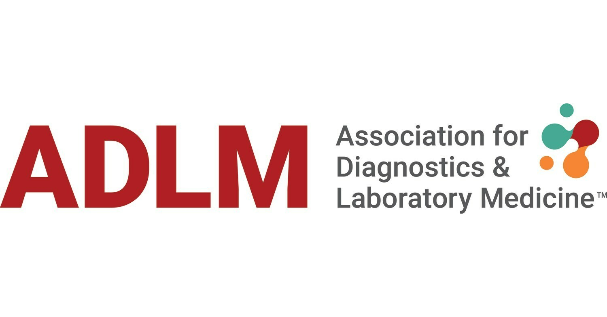

# LabDocs Unlocked

<!-- 

 -->

The 2025 ADLM Data Science Challenge

## Introduction

Laboratories generate vast amounts of documentation, ranging from protocols and package inserts to regulatory materials like 510K clearance documents and checklists. These critical resources require significant time and effort to navigate, presenting a challenge for efficient decision-making and compliance management.

The 2025 ADLM Data Science Challenge seeks to address this gap by leveraging the power of AI to create a tool capable of quickly and accurately extracting and presenting user-requested information from these complex document stores. The proposed solution would ensure that laboratory professionals can focus on impactful work rather than time-intensive document searches.

## The Challenge

### <i>Develop a Tool for Extracting User-Requested Information from a Laboratory Document Store</i>

    We want you to develop an AI tool to make looking up information in laboratory documentation faster and more efficient. 
    We will provide a representative set of documents comprising synthetic laboratory protocols and real FDA 510K clearance documents. The tool should ingest these documents, then extract and present information from those documents at the user's request. 

<h2>Preliminary competition and scoring</h2>

    Teams will participate in a preliminary competition where they will be scored based on the quality and performance of their solution. Scoring is based on the following:

<h3>User experience (xx points)</h3>

    An optimal tool would be intuitive and interactive, allowing users to easily navigate and interact with the tool. 

<h3>Explainability (xx points)</h3>

An optimal solution would provide references or links to relevant sections the document store to improve user confidence and facilitate additional document exploration.

<h3>
    Best  practices (xx points)
</h3>

    Best practices in software development help to optimize quality, maintainability, and reusability. 
    Note that source code and commit histories are required to be eligible for points in this section.

<dl>
    <dt>
        Readability (4 points)
    </dt>
    <dd>
        Code is clearly and cleanly commented (1 point) 
        Code is simple and not bloated (1 point) 
        Code utilizes a clear and consistent naming convention (1 point) 
        Code is organized into hierarchy of modular functional units (1 point)
    </dd>
    <dt>
        Reusability (2 points)
    </dt>
    <dd>
        Code utilizes functionalized or object oriented programming (1 point) 
        Code can be repurposed to ingest a new document store without modification of source code (1 point) 
    </dd>
    <dt>
        Version control (2 points)
    </dt>
    <dd>
        Version control system used to track development (1 point) 
        Commits are modular, logical, and appropriately scoped (1 point)
    </dd>
    <dt>
        Documentation and deployment (4 points)
    </dt>
    <dd>
        Usage notes provided (1 point) 
        Dependencies are defined (1 point) 
        Virtualized or containerized environment used (1 point) 
        Tool accessible through web hosting (1 point)
    </dd>
</dl>
<h2>
    Final (live) competition
</h2>

    The top two teams from the preliminary competition will be invited to present their solution in a live Webinar/competition event. The teams will be judged on the speed and accuracy of their responses to a new set of questions presented "game show style". The team with the highest score will be declared the winner.

<h2>
    Significance
</h2>

    Efficient access to laboratory documentation is essential for maintaining compliance, ensuring quality, and accelerating decision-making. This challenge addresses the inefficiencies caused by the complexity and volume of such documents by leveraging AI to streamline information retrieval. The resulting tool has the potential to transform workflows, reduce errors, and set a new standard for document management in laboratory practice.

<h2>
    Timeline
</h2>

<table>
    <tr>
        <th>
            July 21st, 2025
        </th>
        <td>
            Competition Begins
        </td>
    </tr>
    <tr>
        <th>
            November 15st, 2025
        </th>
        <td>
            Competition Ends
        </td>
    </tr>
    <tr>
        <th>
            December 15th, 2025
        </th>
        <td>
            Announcement of Winning Team
        </td>
    </tr>
    <tr>
        <th>
            January, 2026 (Anticipated)
        </th>
        <td>
            Finalist Prentation and Competition Webinar
        </td>
    </tr>
</table>

<h2>
    How to Participate
</h2>

<h3>
    Sign up for a GitHub.com account
</h3>
<ol>
    <li>
        Navigate to <a href='https://github.com/'>https://github.com</a>
    </li>
    <li>
        Click 'Sign up'
    </li>
    <li>
        Follow the prompts to create your personal account
    </li>
</ol>

<h3>
    Fork the competition repository
</h3>
<dl>
<ol>
    <li>
        Navigate to <a href='https://github.com/WUSM-LGM-Informatics-Section/2025_ADLM_Data_Analytics_Challenge'>https://github.com/WUSM-LGM-Informatics-Section/2025_ADLM_Data_Analytics_Challenge </a>
    </li>
    <li>
        Click 'Fork'
    </li>
    <li>
        Select 'Create a new fork'
    </li>
    <li>
        Set your GitHub account as the owner (default)
    </li>
    <li>
        Click 'Create fork'
    </li>
</ol>

<h3>
    Download the dataset
</h3>
<ol>
    <li>
     ZENODO....
    </li>
</ol>
<h3>
    Build your solution
</h3>
<ol>
    <li>
        Clone the forked repository 
        
            git clone https://github.com/WUSM-LGM-Informatics-Section/2025_ADLM_Data_Analytics_Challenge
         
        Note: Replace myGitHubUsername with your GitHub handle
    </li>
    <li>
        Make a folder in the cloned repository with your team name
    </li>
    <li>
        Build your solution within your team folder
    </li>
</ol>

<h3>
    Submit your solution via a pull request
</h3>
<ol>
    <li>
        Navigate to <a href='https://github.com/WUSM-LGM-Informatics-Section/2025_ADLM_Data_Analytics_Challenge'>https://github.com/WUSM-LGM-Informatics-Section/2025_ADLM_Data_Analytics_Challenge</a> 
        Note: Replace myGitHubUsername with your GitHub handle
    </li>
    <li>
        Click 'Contribute'
    </li>
    <li>
        Select 'Open pull request' 
    </li>
    <li>
        Click 'Create pull request'
    </li>
    Note: we will review your pull request to ensure that it contain everything needed to score your submission 
    <u><strong>Important: You must submit your solution by May 15th, 2024 to be eligible to win the competition</strong></u>
    </li>
</ol>

<h2>
    Need Help?
</h2>

    If you are unfamiliar with GitHub, need help getting starting, or have other questions, please email mboyle@myadlm.org for assistance.

<h2>
    Reference
</h2>
<ol style="line-spacing:4">

</ol>
